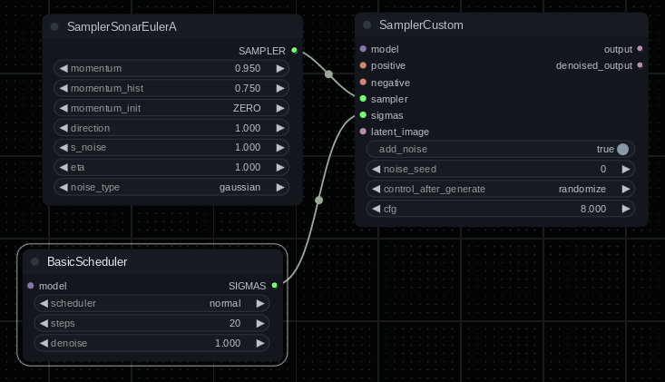

# ComfyUI-sonar

A janky implementation of Sonar sampling (momentum-based sampling) for [ComfyUI](https://github.com/comfyanonymous/ComfyUI) as well as an assortment of advanced noise tools.

Disclaimer: It's very likely stuff like implementation and inputs to nodes will still be changing fairly frequently. In other words, don't depend on reproduceable generations with this unless you're willing to keep track of the git revision something was generated with.

Momentum based sampling currently supports Euler, Euler Ancestral, and DPM++ SDE sampling.

See the [ChangeLog](changelog.md) for recent user-visible changes.

## Description

This started out as an implementation of Sonar sampling and has evolved into something more like a noise toybox.

Please note that while a lot of the nodes in here have a `Sonar` prefix, that doesn't indicate a relation with
the original Sonar sampling implementation. Why is there random noise stuff in this repo? Mainly because it gets
very awkward having node collections depending on other node collections.

Keep reading below this section for information on Sonar sampling and associated nodes.

For information on the advanced noise tools which include many different noise types, nodes to schedule,
composite and otherwise manipulate noise see:

* [Base Noise Types](docs/base_noise_types.md) - examples and descriptions of the base noise types.
* [Advanced Power Noise](docs/advanced_power_noise.md) - examples and descriptions of the advanced power noise node.
* [Advanced Noise Nodes](docs/advanced_noise_nodes.md) - examples and descriptions of advanced noise nodes (schedule, composite, etc).
* [FreeU Extreme](docs/frux.md) - a build your own FreeU kit that allows advanced filtering, blending, scheduling of effects as well as targetting input and middle blocks.

## Sonar Description

See https://github.com/Kahsolt/stable-diffusion-webui-sonar for a more in-depth explanation.

The `direction` parameter should (unless I screwed it up) work like setting sign to positive or negative: `1.0` is positive, `-1.0` is negative. You can also potentially play with fractional values.

Like the original documentation says, you normally would not want to set `momentum` to a value below `0.85`. The default values are considered reasonable, doing stuff like using a negative direction may not produce good results.

## Usage

The most flexible way to use this is with a custom sampler:

You can also just choose `sonar_euler`, `sonar_euler_ancestral` or `sonar_dpmpp_sde` from the normal samplers list (will use the default settings). I personally recommend using the custom sampler approach and the ancestral version.

## Nodes

### `SamplerSonarEuler`

Custom sampler node that combines Euler sampling and momentum and optionally guidance. A bit boring compared to the ancestral version but it has predictability going for it. You can possibly try setting init type to `RAND` and using different noise types, however this sampler seems _very_ sensitive to that init type. You may want to set direction to a very low value like `0.05` or `-0.15` when using the `RAND` init type. Setting `momentum=1` is the same as disabling momentum, so this sampler with `momentum=1` is basically the same as the basic `euler` sampler.

### `SamplerSonarEulerAncestral`

Ancestral version of the above. Same features, just with ancestral Euler.

### `SamplerSonarDPMPPSDE`

Attempt to add momentum and guidance to the DPM++ SDE sampler. It may not work correctly but you can sample stuff with it and get interesting results. I actually really like this one, and you can get away with more extreme stuff like `green_test` noise and still produce reasonable results. You may want to use the `BlehDiscardPenultimateSigma` node from my [ComfyUI-bleh](https://github.com/blepping/ComfyUI-bleh) collection if you find the result seems a bit washed out and blurry.

### `SonarGuidanceConfig`

You can optionally plug this into the Sonar sampler nodes. See the [Guidance](#guidance) section below.

## Sonar Sampler Parameters

Very abbreviated section. The init type can make a big difference. If you use `RANDOM` you can get away with setting `direction` to high values (like up to `2.25` or so) and absurdly low values (like `-30.0`). It's also possible to set `momentum` and `momentum_hist` to negative values, although whether it's a good idea...

## Guidance

You can try the `SamplerSonarNaive` sampler which has an optional latent input. The guidance _probably_ isn't working correctly and the implementation definitely isn't exactly the same as the original A1111 version but it still might be fun to play with. The `linear` guidance type is a lot more sensitive to the `guidance_factor` than the `euler` type. For `euler`, reasonable values are around `0.01` to `0.1`, for `linear` reasonable values are more like `0.001` to `0.02`. It is also possible to set guidance factor to a negative value, I've found this results in high contrast and very vivid colors.

It is possible to set the start and end steps guidance is activate. Rather than setting a low guidance and using it for the whole generation, it's also possible to set high guidance and end it after a relatively low number of steps.

Without guidance it should basically work the same as the ancestral Euler version. There are some example images in the [Examples](#examples) section below.

**Note**: The reference latent needs to be the same size as the one being sampled. Also note that step numbers in the step range are 1-based and inclusive, so 1 is the first step.

## Noise

See [Base Noise Types](docs/base_noise_types.md) for examples.

The sampler and `NoisyLatentLike` nodes now take an optional `SonarCustomNoise` input.

**Note**: If you connect the optional `SonarCustomNoise` node to a Sonar sampler, the `NoisyLatentLike` node or the `SamplerConfigOverride` node, it will override the noise type selected in the node.

## Integrations

You'll get some bonus features if you have some other node collections installed:

### `KRestartSamplerCustomNoise`

If you have a recent enough version of [ComfyUI_restart_sampling](https://github.com/ssitu/ComfyUI_restart_sampling/)
installed, you'll also get the `KRestartSamplerCustomNoise` node which is exactly the same as `KRestartSamplerCustom`
except for adding an optional custom noise input.
See the restart sampling repo for more information: https://github.com/ssitu/ComfyUI_restart_sampling

### `RestartSamplerCustomNoise`

As above, except this is the custom sampler version.

## Related

I also have some other ComfyUI nodes here: https://github.com/blepping/ComfyUI-bleh/

## Credits

Original Sonar Sampler implementation (for A1111): https://github.com/Kahsolt/stable-diffusion-webui-sonar

My version was initially based on this Sonar sampler implementation for Diffusers: https://github.com/alexblattner/modified-euler-samplers-for-sonar-diffusers/

Many noise generation functions copied from https://github.com/Clybius/ComfyUI-Extra-Samplers with only minor modifications. I may have broken some of them in the process _or_ they may not have been suitable for use and I took them anyway. If they don't work it is not a reflection on the original source.

New pyramid noise based on implementation in [Jonathan Whitaker](https://wandb.ai/johnowhitaker/multires_noise/reports/Multi-Resolution-Noise-for-Diffusion-Model-Training--VmlldzozNjYyOTU2)'s article on multi-resolution noise.

Original `SonarPowerNoise` contributed by [elias-gaeros](https://github.com/elias-gaeros/). Additionally, he provided a lot of guidance with refactoring it to allow separate filtering and other enhancements and answered a multitude of dumb questions. To say those changes are only co-authored is probably giving myself too much credit. Thank you! Your patience and help is very much appreciated.

## Sonar Examples

Unfortunately, right now these examples are somewhat incomplete and out of date. I hope to update them when I get the time.

### Guidance

Expand guidance example images

#### Positive

Using the `linear` guidance type and `guidance_factor=0.02`. The reference image was a red and blue checkboard pattern.

#### Negative

Using the `linear` guidance type and `guidance_factor=-0.015`. The reference image was a red and blue checkboard pattern.

### Noise Types

See:

* [Base Noise Types](docs/base_noise_types.md)
* [Advanced Power Noise](docs/advanced_power_noise.md)
* [Advanced Noise Nodes](docs/advanced_noise_nodes.md)
