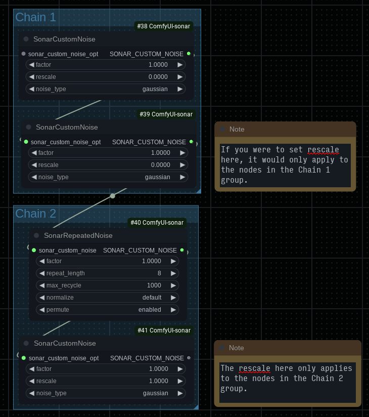

# Advanced Nodes

## Normalization

Normalization essentially rebalances the noise (or mixture of noise) to 1.0 strength and then scales based
on the factor of the node. Most nodes will allow you to set three values:

* `default`: By default, noise will be normalized only just before it's used. So you could consider this setting to be false except for where it is connected to an actual noise consumer (i.e. a `SamplerConfigOverride` node).
* `forced`: Will always normalize.
* `disabled`: Will never normalize.

## `SONAR_CUSTOM_NOISE`

This node output type actually constitutes a chain of noise items. For most nodes, when you use it as input,
they will add an item to the chain. There are some exceptions that treat the `SONAR_CUSTOM_NOISE` input as a list:

* `SonarRepeatedNoise`
* `SonarRandomNoise`

There are also some exceptions that will consume the list rather than adding an item to it:

* `SonarModulatedNoise`
* `SonarCompositeNoise`
* `SonarScheduledNoise`
* `SonarGuidedNoise`

The distinction is mainly only important when setting `rescale`. Visual example:



It may be counter intuitive that there are actually two separate chains here.

## Examples

Note on the examples included for some of these nodes:

The example images included for some of these nodes all have metadata and can be loaded in ComfyUI.
Generated using `dpmpp_2s_ancestral`, Karras scheduler and starting out with gaussian noise then switching
to the custom noise type at the 35% mark.

***

### `SonarCustomNoise`

You can chain `SonarCustomNoise` nodes together to mix different types of noise. The order of `SonarCustomNoise` nodes is not important.

Parameters:

- `factor` controls the strength of the noise.
- `rescale` controls rebalancing `factor` for nodes in the chain. When `rescale` is set to `0.0`, no rebalancing will occur. Otherwise the current node as well as the nodes connect to it will have their `factor` adjusted to add up to the rescale value. For example, if you have three nodes with `factor` 1.0 and the last with `rescale` 1.0, then the `factor` value will be adjusted to `1/3 = 0.3333...`. *Note*: Rescaling uses the `factor` absolute value.
- `noise_type` allows you to select the built-in noise type.

***

### `SonarCustomNoiseAdv`

Same as the `SonarCustomNoise` except it also includes a text widget for passing parameters by YAML or JSON (JSON is valid YAML).

Just for example, instead of using the absurdly large `SonarAdvancedDistroNoise` node, you could do something like:

```yaml
distro: wishart
quantile_norm: 0.5
wishart_cov_size: 4
wishart_df: 3.5
```

***

### `NoisyLatentLike`

This node takes a reference latent and generates noise of the same shape. The one required input is `latent`.

You can connect a `SonarCustomNoise` or `SonerPowerNoise` node to the `custom_noise_opt` input: if that is attached, the built in noise type selector is ignored. The generated noise will be multiplied by the `multiplier` value. **Note**: If you select `brownian` noise (either through the dropdown or by connecting custom noise nodes) you must connect a model and sigmas.

The node has two main modes: simply generate and scale the noise by the multiplier and return or add it to the input latent. In this mode, you don't connect anything to the `mul_by_sigmas_opt` or `model_opt` inputs and you would use other nodes to calculate the correct strength.

In the second mode you must connect sigmas (for example from a `BasicScheduler` node) to the `mul_by_sigmas_opt` input and connect a model to the `model_opt` input. It will calculate the strength based on the first item in the list of sigmas (so you could use something like a `SplitSigmas` node to slice them as needed). Note that `multiplier` still applies: the calculated strength will be scaled by it. This second mode is generally this is the most convenient way to use the node since the two main uses cases are: making a latent with initial noise or adding noise to a latent (for img2img type stuff).

If you want to create noise for initial sampling, connect model and sigmas to the node, connect an empty latent (or one of the appropriate size) to it and that is basically all you need to do (aside from configuring the noise types). For img2img (upscaling, etc), either slice the sigmas at the appropriate or set a denoise in something like the `BasicScheduler` node. *Note*: For img2img, you also need to turn on the `add_to_latent` toggle. Turning this on doesn't matter for initial noise since an empty latent is all zeros.

**Note**: This node does not currently respect the latent noise mask.

***

### `SamplerConfigOverride`

This node can be used to override configuration settings for other samplers, including the noise type. For example, you could force `euler_ancestral` to use a different noise type. It's also possible to override other settings like `s_noise`, etc. *Note*: The wrapper inspects the sampling function's arguments to see what it supports, so you should connect the sampler directly to this rather than having other nodes (like a different sampler wrapper) in between.

You can enter YAML parameters in the text input, these arguments are passed directly to the sampler function without any error checking. If the same key exists in the node itself (i.e. `s_noise`) the one in the text input will take precedence. Note that these are based on the internal sampler function so the names of the arguments won't necessarily be the same as the sampler node (but they often are). You may need to check the source code for the sampler.

***

### `SONAR_CUSTOM_NOISE to NOISE`

This node can be used to convert Sonar custom noise to the `NOISE` type used by the builtin `SamplerCustomAdvanced` (and any other nodes that take a `NOISE` input).

***

### `SonarAdvancedPyramidNoise`

Allows setting some parameters for the pyramid noise variants (`pyramid`, `highres_pyramid` and `pyramid_old`). `discount` further from zero generally results in a more extreme colorful effect (can also be set to negative values). Higher `iterations` also tends to make the effect more extreme - zero iterations will just return normal Gaussian noise. You can also experiment with the `upscale_mode` for different effects.

### `SonarAdvanced1fNoise`

More extensive documentation TBD (hopefully). For now, a few recipes:

These differ differ only in alpha. For the other parameters, use `k=1, vf=1, hf=1, use_sqrt=true` to start.

* `blue`: `alpha=1`
* `green`: `alpha=0.75`
* `pink`: `alpha=0.5`
*

### `SonarAdvancedPowerLawNoise`

More extensive documentation TBD (hopefully). For now, a few recipes:

* `white`: `alpha=0, use_sign=true, div_max_dims=none`
* `grey`: `alpha=0, use_sign=false, div_max_dims=none`
* `velvet`: `alpha=1, use_sign=true, div_max_dims=all, use_div_max_abs=true`
* `violet`: `alpha=0.5, use_sign=true, div_max_dims=all, use_div_max_abs=true`

***

## `SonarWaveletFilteredNoise`

You will need [pytorch_wavelets](https://github.com/fbcotter/pytorch_wavelets) installed in your Python environment to use this one.

Allows filtering another noise source using wavelets. Parameters are specified using YAML (or JSON) in the text widget. The defaults are:

```yaml
use_dtcwt: false
mode: periodization
level: 3
wave: haar

# Only used in DTCWT mode.
qshift: qshift_a
# Only used in DTCWT mode.
biort: near_sym_a

# Additional parameters for the inverse wavelet operation
# are null by default and will use whatever the
# forward parameter is set to:
#   inv_mode, inv_wave, inv_biort, inv_qshift
# Note: Using different parameters for the inverse wavelet
#       operation may not work well (or just fail entirely).

# Scale for the lowpass filter.
yl_scale: 1.0

# Scales for the highpass filter. Can be a single value (null is basically 1.0).
yh_scales: null
```

***

## `SonarQuantileFilteredNoise`

Allows quantile normalizing of arbitrary noise generators, works like the `SonarAdvancedDistroNoise` node (see below).

***

### `SonarAdvancedDistroNoise`

See: https://pytorch.org/docs/stable/distributions.html

For the most part, we just pass parameters directly to PyTorch's distribution classes. Some of them have specific requirements so it is possible to set invalid parameters.

It may be more convenient to specify parameters using the `SonarCustomNoiseAdv` node than this gigantic monstrosity of a node. **Note**: In that case, pass the distribution name using `distro`, i.e. `distro: laplacian`.

Common parameters:

* `quantile_norm`: When enabled, will normalize generated noise to this quantile (i.e. 0.75 means outliers >75% will be clipped). Set to 1.0 or 0.0 to disable quantile normalization. A value like 0.75 or 0.85 should be reasonable, it really depends on the distribution and how many of the values are extreme. Some actually work better with quantile normalization disabled.
* `quantile_norm_mode`: Controls what dimensions quantile normalization uses. By default, the noise is flattened first. You can try the nonflat versions but they may have a very strong row/column influence. Only applies when quantile_norm is active.
* `result_index`: When noise generation returns a batch of items, it will select the specified index. Negative indexes count from the end. Values outside the valid range will be automatically adjusted. You may enter a space-separated list of values for the case where there might be multiple added batch dimensions. Excess batch dimensions are removed from the end, indexe from result_index are used in order so you may want to enter the indexes in reverse order. Example: If your noise has shape `(1, 4, 3, 3)` and two 2-sized batch dims are added resulting in `(1, 4, 3, 3, 2, 2)` and you wanted index 0 from the first additional batch dimension and 1 from the second you would use result_index: `1 0`

Individual distributions have parameters beginning with their name, i.e. `laplacian_loc`. Parameters that are string inputs usually allow entering multiple space-separated items. This will usually result in the output noise being a batch, which can be selected with the `result_index` parameter.

Suggestions for fun distributions to try: Wishart and VonMises can produce some interesting results.

***

### `SonarModulatedNoise`

Experimental noise modulation based on code stolen from
[ComfyUI-Extra-Samplers](https://github.com/Clybius/ComfyUI-Extra-Samplers). `intensity` and `frequency` modulation
types _probably_ do not work correctly for normal sampling — I expect the modulation will be based on the tensor
where the noise sampler was created rather than each step. However it may be useful for something like restart sampling
noise (see `KRestartSamplerCustomNoise` below). You can also pass it a reference latent to modulate based on
instead (only used for `intensity` and `frequency` modulation types).

*Note*: It's likely this node will be changed in the future.

<details>

<summary>⭐ Expand Example Images ⭐</summary>

<br/>

These examples all use the `spectral_signum` modulation type as it doesn't depend on a reference.

#### Positive Strength

Dims 3:


Dims 3 (with studentt noise):


Dims 2:


Dims 1:


#### Negative Strength

Dims 3:


Dims 3 (with studentt noise):


Dims 2:


Dims 1:


</details>

***

### `SonarRepeatedNoise`

Experimental node to cache noise sampler results. Why would you want to do this? Some noise samplers are
relatively slow (`pyramid` for example) or it may be slow to generate noise if you are mixing many types
of noise. When `permute` is enabled, a random effect like flipping the noise or rolling it in some dimension
will be chosen each time the noise sampler is called. I recommend leaving `permute` on. Note that repeated
noise (especially with `permute` disabled) can be stronger than normal noise, so you may need to rescale to
a value lower than `1.0` or decrease `s_noise` for the sampler. You may also set the maximum number of
times noise is reused by setting `max_recycle`.

<details>

<summary>⭐ Expand Example Images ⭐</summary>

<br/>

Repeated noise is very strong (especially when permute is disabled). You generally won't get good
results using 1.0 strength:


I recommend considerably decreasing the strength (example here is using 0.75 which is still a bit too much):


</details>

***

### `SonarCompositeNoise`

Allows compositing noise types based on a mask. Noise is mixed based on the strength of the mask at a location.
For example, where the mask is 1.0 (max strength) you will get 100% `noise_src` and 0% `noise_dst`. Where the
mask is 0.75 you will get 75% `noise_src` and 25% `noise_dst`.

<details>

<summary>⭐ Expand Example Images ⭐</summary>

<br/>

These examples use a base noise type of gaussian and composite in an area with a different type
near middle. The custom noise is also set to a higher strength than normal to highlight the effect.

**No Composite (for comparison)**


**Brownian**


**Pyramid**


**Pyramid negative factor**


</details>

***

### `SonarScheduledNoise`

Allows switching between noise types based on percentage of sampling (note: not percentage of steps).

**Note**: You don't have to connect the fallback noise type but the default is to generate _no_ noise, which
is most likely not what you want. The majority of the time, it is recommend to connect something like gaussian
noise at 1.0 strength.

All the example images here use the `SonarScheduledNoise` node so you can pick any one of them to see it
in action!

***

### `SonarGuidedNoise`

Works similarly as described in the [Guidance](../README.md#guidance) section of the main README, however the guidance is applied
to the raw noise. You can use `SonarScheduledNoise` to only apply guidance at certain times. Using `euler`
mode seems considerably stronger than `linear`. The default value should be reasonable for `euler`, may need to be
increased somewhat for `linear`.

<details>

<summary>⭐ Expand Example Images ⭐</summary>

<br/>

#### Pattern

These examples use a half circle pattern as the reference: 


##### Euler

Positive strength:


Negative strength:


***

##### Linear

Normal positive strength:


Normal negative strength:


Strong positive strength:


Strong negative strength:


***

#### Gradient

These examples use a vertical gradient as the reference: 

That is dark to light. Light to dark examples just flip the gradient vertically.

##### Euler

Dark to light:


Light to dark:


Dark to light (negative strength):


Light to dark (negative strength):


***

##### Linear

Dark to light:


Light to dark:


Dark to light (negative strength):


Light to dark (negative strength):


</details>

***

### `SonarRandomNoise`

Randomly chooses between the noise types in the chain connected to it each time the noise sampler is called.
You generally do not want to use `rescale` here. You can also set `mix_count` to choose and combine multiple
types.

### `SonarChannelNoise`

Allows using a different noise generator per channel. The custom noise items attached to this node are treated as a list where the furthest item from the node will correspond to channel 0. For example where CN is a custom noise node and SCN is the `SonarChannelNoise` node:

```plaintext
CN (channel 0) -> CN (channel 1) -> SCN
```

Don't enable `rescale` in the custom noise nodes attached to `SonarChannelNoise`. If you want a blend of noise types for a channel, you can use something like `SonarBlendedNoise`.

### `SonarBlendedNoise`

Allows blending two noise generators. If [ComfyUI-bleh](https://github.com/blepping/ComfyUI-bleh) is available, you will have access to many more blending modes.

### `SonarBlehOpsNoise`

Only provided if [ComfyUI-bleh](https://github.com/blepping/ComfyUI-bleh) is available. Allows transforming/manipulating noise with bleh blockops expressions. For instance, you can do something like:

```yaml
- ops:
  - [multiply, -1]
  - [roll, -2, 0.5]
```

to flip the sign on the noise and then roll dimension -2 (height) by 50%.

### `SonarAdvancedVoronoiNoise`

This node can create multi-octave 3D Voronoi noise (also known as Worley noise). See: https://en.wikipedia.org/wiki/Worley_noise

Similar to Pyramid and other weird noise types, this noise generally will require mixing with something more normal. The default settings actually just about work with SDXL.

The node has many options for calculating the distance between the feature points and for processing the output. The modes are entered as a string, you can hover over the widget to get a brief list of possible modes. Both distance and result modes support some common features:

* You can enter a comma-separated list of modes. This allows using a different mode per octave. If there are more octaves than you have modes defined, the mode will wrap. In other words, if you're generating three octaves and you define two modes then the third octave will use the first mode you defined.
* You can enter a `+` (plus symbol) separated list of modes. The modes will be calculated and the result will be the average. Distance modes all have the common parameter `dscale` which defaults to 1 and can be overridden. Result modes use `rscale`. See below for a description on passing parameters.
* It's possible to pass parameters to distance and result modes. Example with a result mode: `diff:idx1=0:idx2=1:rscale=0.5`

**Note**: Some modes act as wrappers for other modes. Unfortunately, there isn't currently a good way to escape parameters. Modes ignore parameters they don't understand and the wrapper modes will pass through any parameters they don't use themselves so you _can_ pass parameters to the submodes as long as they don't conflict (and only up to one level).

#### Distance Modes

Modes listed with the defaults for parameters they support. These modes also support `dscale` which defaults to 1 and can be used to manually adjust the scale of the mode result.

* `euclidean`
* `manhatten`
* `chebyshev`
* `minkowsi:p=3.0`
* `quadratic`
* `angle:idx=2` - idxs here range from 0 to 2.
* `angle_tanh:idx=2` - Same as `angle` but scales the result with tanh.
* `angle_sigmoid:idx=2` - Same as `angle` but scales the result with the sigmoid function.
* `fuzz:name=euclidean:fuzz=0.25` - Acts as a wrapper for another result mode (specified with `name`). Will perturb the result by `fuzz` percent of the absolute maximum value. Or more simply, randomizes values by +/- `fuzz` percentage so if you set `fuzz=1` you will essentially get pure noise.

#### Result Modes

Modes listed with the defaults for parameters they support. These modes also support `rscale` which defaults to 1 and can be used to manually adjust the scale of the mode result.

* `f1` - distance to the closest cell.
* `f2`, `f3`, `f4` - Same as `f1` but for the second closest, third closest, etc. Goes up to `f4`.
* `f:idx=0` - Allows specifying `f` modes over `f4`. Note that `idx` is zero-based so 0 corresponds to `f1`.
* `inv_f1` (through `inv_f4`). For `inv_f1`, the result is `1 / f1` (with a tiny value added to avoid divide by zero).
* `inv_f:idx=0` - Like the `f` mode using the formula described above.
* `diff:idx1=0:idx2=1` - Zero based indexes where 0 corresponds to `f1`, etc. For the default (`f1` and `f2`) the result is `f2 - f1`.
* `diff2:idx1=0:idx2=1` - Similar to `diff` described above, however the result is divided by the two `f` results (plus a tiny addition to avoid divide by zero). For example with the defaults this works out to `(f2 - f1) / (f2 + f1)`.
* `cellid` - Returns a discrete value for the area of each cell (diffusion models hate this). You will need to dilute the Voronoi noise a lot to actually use this. It could also possibly be used for masking.
* `median_distance`
* `fuzz:name=f1:fuzz=0.25` - Works the same as `fuzz` in distance modes. See the description there.

#### Depth


The node has several `z`-related parameters. `z` here refers to the depth dimension and will (currently) only apply if you're using the same noise sampler more than once. So generally not for initial noise, unless you're doing something unusual.

When `z_max` is set to 0 the feature points will be reset each time the noise sampler is called. Otherwise it will track the current `z` (depth) and increment it by whatever you specify each time the noise sampler is called. `SonarPerDimNoise` can be useful here if you want depth over dimensions like batch or channels.
