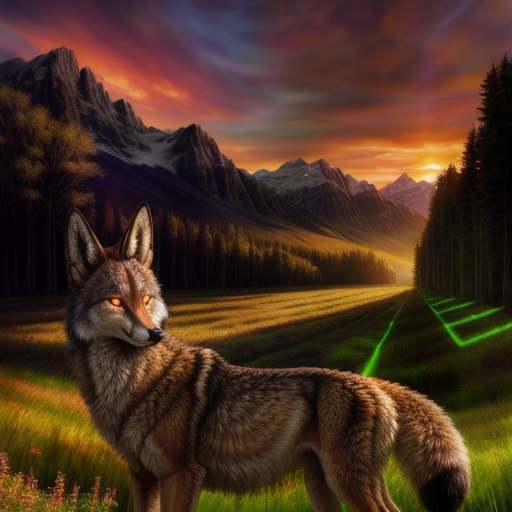
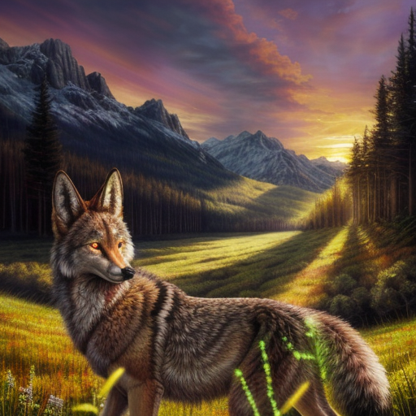

# Base Noise Examples

The example images are all workflow-included. Generated using `dpmpp_2s_ancestral`, Karras scheduler and
starting out with gaussian noise then switching to the custom noise type at the 35% mark.

Some of these noise types are too extreme to be used for initial generations or even with pure
noise of that type. However you can either schedule the noise type to kick in at a certain percentage
(as in these examples) and/or mix it with something a bit more run of the mill. See
[advanced_noise_nodes](advanced_noise_nodes.md).

## Documentation TBD

* `grey`
* `onef_greenish_mix` (50/50 mix of positive/negative noise.)
* `onef_greenish`
* `onef_pinkish_mix` (50/50 mix of positive/negative noise.)
* `onef_pinkish`
* `onef_pinkishgreenish` (50/50 mix of `onef_pinkish` and `onef_greenish`.)
* `velvet`
* `violet`
* `white`

## Brownian

This is the default noise type for SDE samplers.

***
## Gaussian

This is the default noise type for non-SDE samplers.

***

## Green Test

This is _probably_ not actually green noise. It produces a very colorful effect, however
it's very strong and not really suitable for initial generation.

You can also use a negative multiplier to achieve a different effect:

***

## Highres Pyramid

Variation using area scaling:

Variation using bislerp scaling:

***

## Laplacian

***

## Perlin

***

## Pink Old

Previously known as `pink`. The implementation isn't correct, though in terms of results it's fine.

***

## Power Old

Previously known as `power`. The implementation isn't correct, though in terms of results it's fine.

Also see the [Advanced Power Noise](advanced_power_noise.md) examples.

***

## Pyramid

You can also use a negative multiplier to achieve a different effect:

Variation using area scaling:

Variation using bislerp scaling:

***

## Pyramid Discount5

Pyramid noise, generated with a discount of 0.5. (Generally less extreme effect.)

***

## Pyramid Mix

Pyramid mix is a combination of positive and negative pyramid noise. The effect on
the generation is mild compared to raw pyramid noise.

You can also use a negative multiplier to achieve a different effect:

Variation using area scaling:

You can also use a negative multiplier to achieve a different effect:

Variation using bislerp scaling:

You can also use a negative multiplier to achieve a different effect:

***

## Pyramid Old

This may not actually be pyramid noise at all. Also note that it is quite slow to generate as it
effectively generates noise ~60x the latent size.

Variation using area scaling:

Variation using bislerp scaling:

***

## Rainbow

Rainbow is a mix of Perlin and Green noise types.

The "mild" variation uses a relatively low proportion of green noise:

The "intense" variation uses a higher proportion of green noise for a more extreme effect.

***

## Studentt

***

## Uniform

