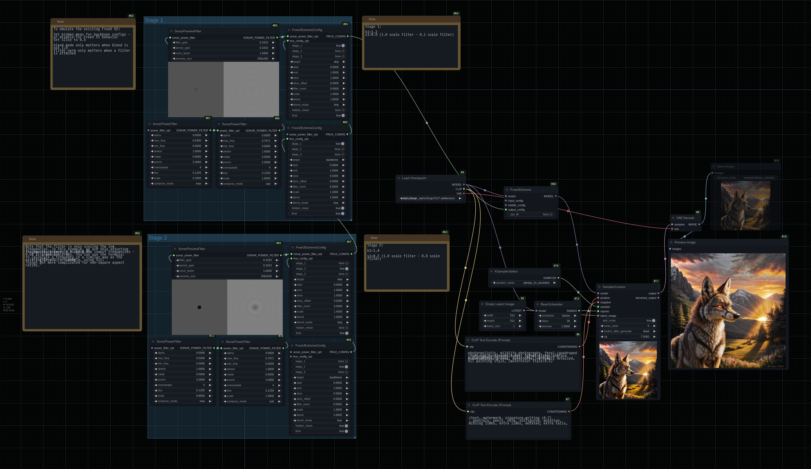

# FreeU Extreme

I admit it's a really dumb name. This is basically a build-your-own FreeU kit.

## Example Workflow

Workflow image is also workflow-embedded.

## Nodes

### `FreeUExtreme`

Allows you to apply a FreeU (v1 or v2) effect to input, output or middle blocks.

**Note**: ComfyUI by default does not allow patching the middle in the required way. You will need to have
[FreeU Advanced](https://github.com/WASasquatch/FreeU_Advanced) installed and enabled, otherwise connecting
configs to the `middle` input will have no effect.

Also note that input and middle do not have a `skip` target so configs targetting that will never match.

### `FreeUExtremeConfig`

Better documentation coming soon hopefully. For now, see the workflow example above to get started.

Also see documentation on filters [here](./advanced_power_noise.md#sonarpowerfilter).

## Examples

ComfyUI built-in FreeU V2 for reference:

FreeU Extreme example:

Note that this is just for example purposes - no attempt was made to get a pretty generation. You
may get better results enabling `hidden_mean` even for the skip connections.
